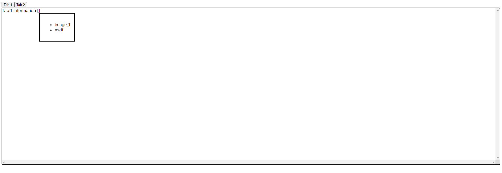
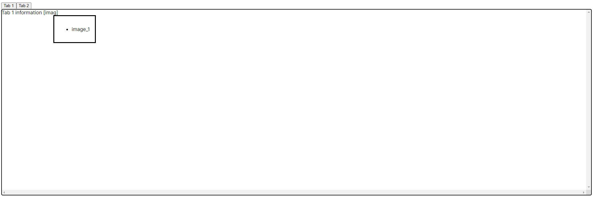
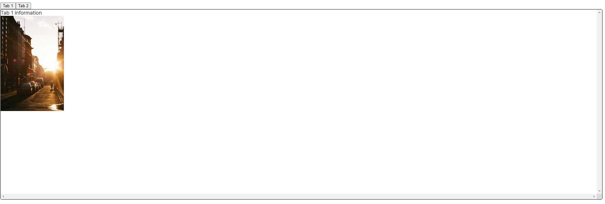

# Text Editor

Este es un editor de texto interactivo desarrollado en React. Permite al usuario escribir y editar contenido, y también ofrece la funcionalidad de añadir imagenes por autocompletado de etiquetas entre corchetes.

## Funcionalidades

- Editor de texto 
- Adicion de imagenes con autocompletado de etiquetas entre corchetes.
- Pestañas para cambiar entre diferentes contenidos.
- Guardado automático del contenido del editor cada 10 segundos (desactivado actualmente).

## Capturas de pantalla

## Instalación

1. Clona este repositorio en tu máquina local.
2. Ejecuta `npm install` para instalar las dependencias.
3. Ejecuta `npm run dev` para iniciar la aplicación.

## Uso

- Haz clic en las pestañas para cambiar entre diferentes contenidos.
- Escribe y edita el contenido del editor de texto.
- Cuando escribas entre corchetes  `[.*]`, se mostrará un cuadro de diálogo con las diferentes imágenes a escoger.